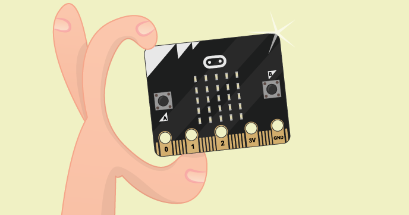

#Introduction

##What you will do

In this 60 minute workshop you will use the **mu** editor on a Raspberry Pi to write MicroPython programs and run them
on the micro:bit. 

MicroPython is a small but very fast version of Python 3 that has been specially designed to work on microcontrollers
such as those found on the micro:bit.

The experiments will show you some of the things the micro:bit can do. You can use them as a base to build your
own projects. 

At the end of this workbook you will find some links to help you explore once the workshop is over.

## What you will need

You'll need a BBC micor:bit and its USB connector. You don't need a battery, as the mirocbit will be
powered via USB.

### If you have a Raspberry Pi

This workbook assumes that you have a working Raspberry Pi with screen, keyboard and mouse, that you will connect via USB
to a BBC micro:bit.

If you have a Raspberry Pi you will need to install the *mu* editor before you can start editing.

Open a terminal window and run the following commands:

    sudo apt-get update
    sudo apt-get upgrade
    sudo apt-get install mu

### If you don't have a Raspberry Pi

If you don't have a Raspberry Pi, don't despair. You can use a desktop or laptop computer with the micro:bit, and you
can use the *mu* editor with Microsoft Windows, Mac OS or Linux. You'll find instructions for
downloading and installing *mu* [here](https://codewith.mu/#download)

##You don't have to finish everything in 60 minutes

You'll have plenty of fun things to do over the next 60 minutes, but don't feel you have to do all of
the experiments right now.

##Let's get started with *mu*!

1. If you haven't installed the *mu* editor on your Raspberry Pi, open a terminal window, type
`sudo apt-get install mu` and wait for the installation to finish.
1. On the Pi, open *Mu* from the main menu under `Programming`.
1. A new window should open up that looks like this:

