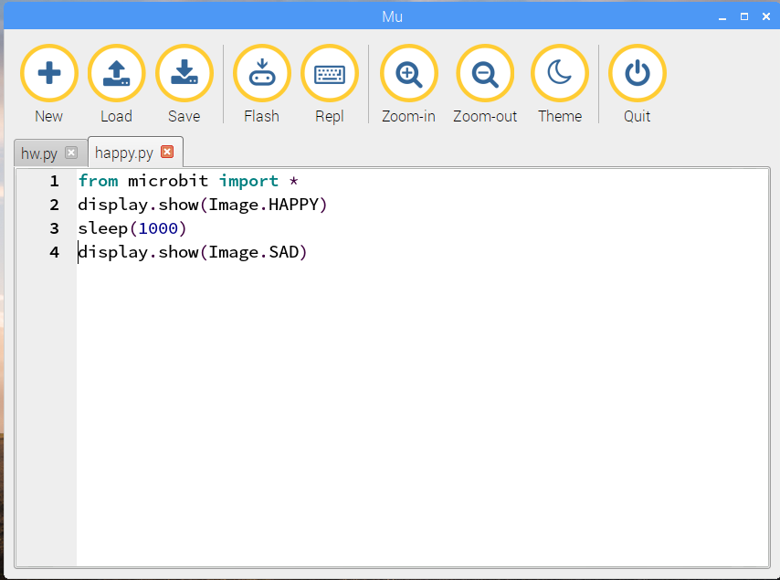

#Images

The micro:bit only has 25 LEDs but that's enough for it to display
recognisable images.

In this experiment you will write code to 

1. display images on the LEDs.
1. change the display while your program is running,
1. display an animation and
1. create your own images

You may not have time to do all these activities today
but you can try them out later.

##Displaying a happy face

Open a new tab in *mu* and type in this program:

    from microbit import *
    display.show(Image.HAPPY)
    

You've seen the first line before. It says you want to use the microbit module
(library).

The second line tells the micro:bit display to show an image. In this case, the
image is pre-defined in the microbit module, and you can refer to it as `Image.HAPPY`
 
Save your program as `happy.py` and click *mu*'s `Flash` button.
Two dialogs will appear again. Close the dialogs as before.
When the flashing stops you should see a happy
face displayed on the micro:bit.

##Changing the display to a sad face

The next program is a little longer, but it starts the same as the previous one.

In the `happy.py` window, add two lines to the end of the program:

    sleep(1000)
    display.show(Image.SAD)

Your editor window should look like this:

Use *mu*'s `Flash` button to install your program.

When the program runs you should see a happy face appear for a second.
Then it will be replaced by a sad face which will
stay on the display until you restart the micro:bit.
    
##Looping - repeating code

If you make a small change to your program you can tell the micro:bit to keep changing
from a happy face to a sad face and back again.

To do that you will need to add a `While loop`. That is one of the ways you can get a
Python program to repeat code over and over again.

Edit your program so that it reads like this:

    from microbit import *

    while True:
        display.show(Image.HAPPY)
        sleep(1000)
        display.show(Image.SAD)
        sleep(1000)

Make sure that:

1. The `w` in `while` is a lower case letter
2. The `T` in `True` is an upper case letter
3. The four lines after `while True:` start with four spaces

`Save`and `Flash` your code.
You should see a face which changes from happy to sad and back again.
Moody or what?

##Making your own images

MicroPython comes with a great set of pre-defined images but you can easily create
your own.

Try creating and running this program:

    from microbit import *

    boat = Image("05050:"
             "05050:"
             "05050:"
             "99999:"
             "09990")

    display.show(boat)
    
Each number specifies a brightness. There are five lines of five numbers so
it’s possible to specify the individual brightness for each of the five pixels
on each of the five lines on the physical display.

That’s how to create a new image.

This example and some of those that follow were copied from the [MicroPython on-line documentation](https://microbit-micropython.readthedocs.io/en/latest/tutorials/images.html#diy-images)

##Animation - images that change

MicroPython makes it really easy to create *animations*: images displayed in sequence.

To see how animations work, and to discover the full power MicroPython's `show`,
copy and run this program:
  
    from microbit import *

    while True:
        display.show(Image.CLOCK12)
        sleep(1000)
        display.show(Image.CLOCK1)
        sleep(1000)
        display.show(Image.CLOCK2)
        sleep(1000)
        display.show(Image.CLOCK3)
        sleep(1000)
        display.show(Image.CLOCK4)
        sleep(1000)
        display.show(Image.CLOCK5)
        sleep(1000)
        display.show(Image.CLOCK6)
        sleep(1000)
                
You should see a clock with the hands going round from 12 o'clock to 6 o'clock.

That's a lot of typing. There are easier ways to do it.

First, lets change the program to create a *list*.

A Python list is a collection of values in a particular order.

In the program that follows you will create a list of clock images called *clock*
and ask Python to show the list repeatedly.

Enter and save this program:

    from microbit import *
    
    clocks = [Image.CLOCK12,
              Image.CLOCK1,
              Image.CLOCK2,
              Image.CLOCK3,
              Image.CLOCK4,
              Image.CLOCK5,
              Image.CLOCK6]
    
    while True:
        display.show(clocks)
        
As you see, you can create a list in Python by enclosing several values in square brackets and
separating the values with commas.

Run this program. It should produce the same output as the earlier version but it's simpler and shorter.

If you wanted to display all twelve clock images you could do it by creating a larger list containing all the values.

There's an even simpler way. The microbit module contains a pre-built list with all twelve clock faces.

Try entering, saving and running this code:

    from microbit import *

    display.show(Image.ALL_CLOCKS, loop=True)
    
Image.ALL_CLOCKS is a pre-defined list of images. The `loop=True` parameter in `show` has the same effect as enclosing
 the statement in a while loop.
