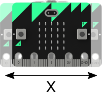

\newpage

#Moving and shaking

In the experiments so far you have used the micro:bit LEDs and buttons, but this cool computer
has several other useful [peripherals]() on  board.

You're about to experiment with the accelerometer - a chip which measures *acceleration*.

We say that something *accelerates* when it changes speed or direction.  Cars, bikes, aeroplanes
accelerate; so you you, when you start or stop walking, or break into a run.

If the micro:bit is moved or shaken, it accelerates and the acceleration is measured by its accelerometer.

The chip on the micro:bit can measure acceleration in three *axes* (directions), called x, y and z.

* The x axis corresponds to acceleration to the left or right
* The y axis corresponds to acceleration forward or backwards
* The z axis corresponds to acceleration up or down

## print() and the REPL

In the first accelerometer experiment you'll run a program that prints out the micro:bit's
acceleration along the x, y and z axis. That's a bit of a challenge; you can't use the display
becuase it's too slow. By the time you read a displayed value, the micro:bit might have changed
direction or stopped accelerating.

Fortunately there is a faster way of showing the output from a Python program. it's called the
`print` function.

When you run Python on a Laptop or desktop computer, a print statement in your program will
display output on the *console* - the window in which you started the Python program.

The micro:bit has no console, but you can still see the output of print statements.
One way to do that is to use the Repl button on the mu program window.

##*Repl* stands for **Read, Evaluate, Print Loop**

Arrow Icon made by [Catalin Fertu](http://www.flaticon.com/authors/catalin-fertu)

When you open the *Repl* window in mu, you can
1. Execute Python code and see the result
1. See the *print*ed output from a running program.

That's enough background.

##Time to get coding!

Open a new *mu* window and enter the following program:

    from microbit import *
    
    while True:
        print(accelerometer.get_x(), accelerometer.get_y(), accelerometer.get_z())
        sleep(100)

Now use the `flash` button to install it on the microbit.

When the micro:bit has finished flashing, your program will start running.

What can you see?  *Nothing!*

The program is printing output, but you can't see it yet.

To see it, you need to do two things:

1. Click on the `repl` button on mu's interface. This will interrupt your program and open mu's
repl window.
1. Restart your program using the micro:bit's `restart` button.

Now you should see a stream of numbers scrolling in the mu repl window.

## Time for some fun

Open a new *mu* window and enter the following program:

    # Magic 8 ball by Nicholas Tollervey. February 2016.
    #
    # Ask a question then shake.
    #
    # This program has been placed into the public domain.
    from microbit import *
    import random # we'll need a random choice to pick a reply
    
    # create a list of possible answers
    answers = [
        "It is certain",
        "It is decidedly so",
        "Without a doubt",
        "Yes, definitely",
        "You may rely on it",
        "As I see it, yes",
        "Most likely",
        "Outlook good",
        "Yes",
        "Signs point to yes",
        "Reply hazy try again",
        "Ask again later",
        "Better not tell you now",
        "Cannot predict now",
        "Concentrate and ask again",
        "Don't count on it",
        "My reply is no",
        "My sources say no",
        "Outlook not so good",
        "Very doubtful",
    ]
    
    # Here's the main loop. It will display an 8 and test if the micro:bit was shaken.
    # If it was, it will pick a reply at random and display it.
    # Finally it will go to sleep for 1/100th of a second and then go around the loop again.
    
    while True:
        display.show('8')
        if accelerometer.was_gesture('shake'):
            display.clear()
            sleep(1000)
            display.scroll(random.choice(answers))
        sleep(10)

The first thing to notice is that the program has lines beginning with a hash character *#*.

(Its proper name is an *octothorpe*, but in the UK everyone calls it a *hash*.)

In Python, everything on a line after a hash character is ignored (by Python),
so you can type a helpful explanation for anyone who reads your code.

Comments are a great way to explain why you wrote a program the way you did,
and they can aso be used to tell the reader who it was that wrote it.

After the introductory comment, the program

1. imports the `microbit` module
1. creates a list of answers
1. when shaken, picks a random answer and displays it
1. sleeps for 1/100th of a second (10 milli-seconds)
1. loops back to step 3 for ever.
 
 