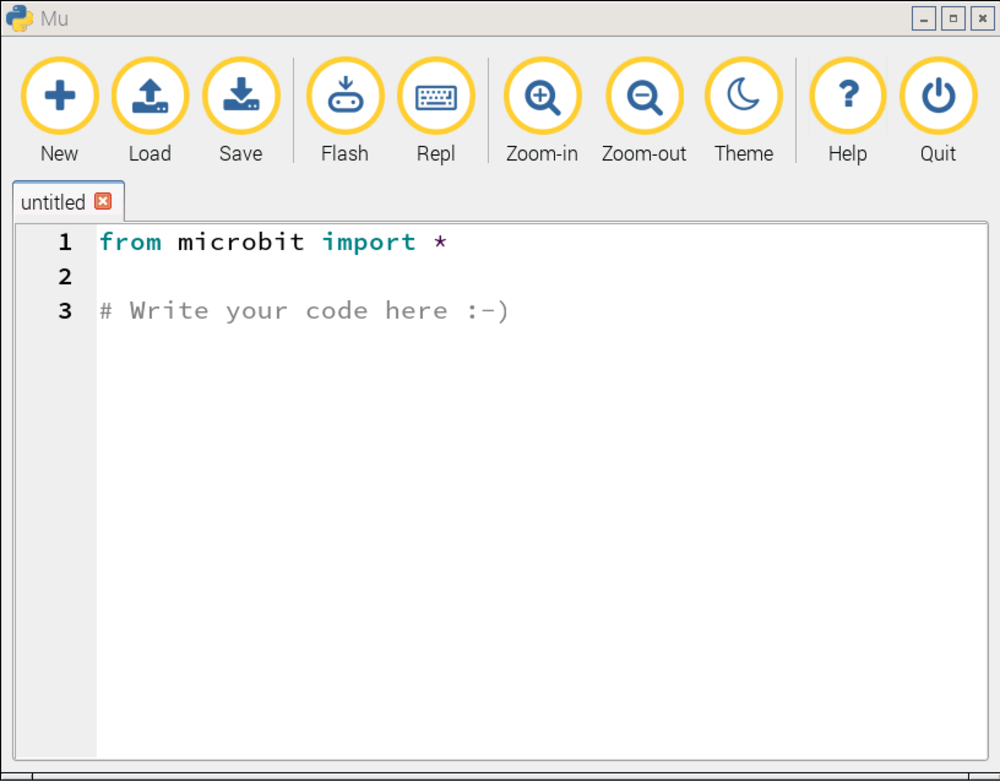

#Introduction

##What you will do

In this 60 minute workshop you will use the **mu** editor on a Raspberry Pi to write MicroPython programs and run them
on the micro:bit. 

MicroPython is a small but very fast version of Python 3 that has been specially designed to work on microcontrollers
such as those found on the micro:bit.

The experiments will show you some of the things the micro:bit can do. You can use them as a base to build your
own projects. 

At the end of this workbook you will find some links to help you explore once the workshop is over 

##You don't have to finish everything today

I hope you'll have plenty of fun things to do over the next 60 minutes, but don't feel you have to do all of
the experiments today. You will be able to keep this workbook and use it once the workshop is over.

##Let's get started with *mu*!

1. If you haven't installed the *mu* editor on your Raspberry Pi, open a terminal window, type
`sudo apt-get install mu` and wait for the installation to finish.
1. On the Pi, open *Mu* from the main menu under `Programming`.
1. A new window should open up that looks like this:

