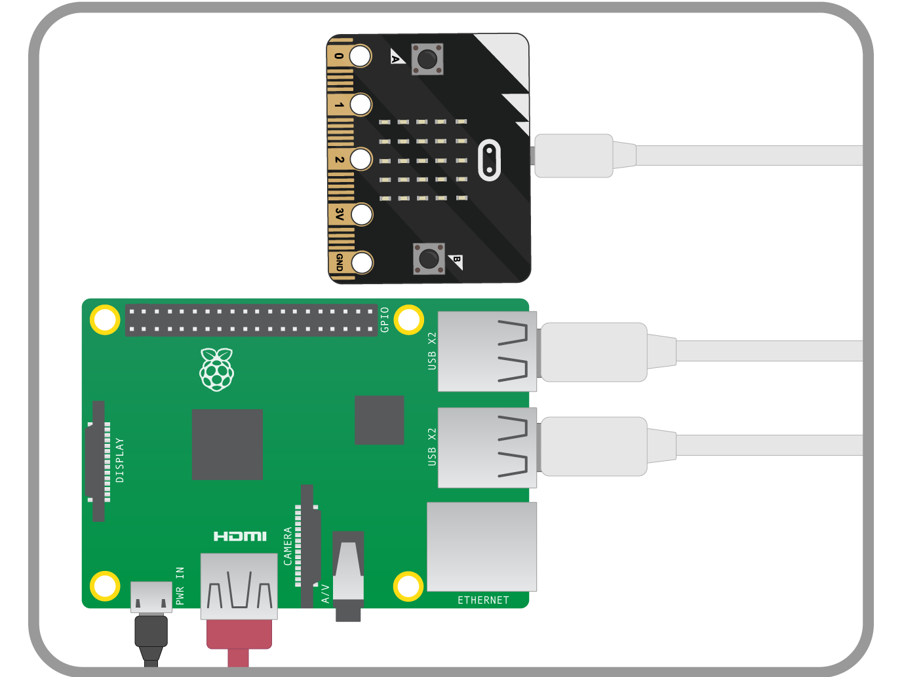
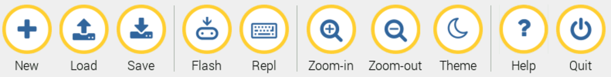

\newpage

#Plugging in your micro:bit

The micro:bit has a micro USB port that you can use to connect it to your Raspberry Pi.
This will provide a power and data connection.

1. Connect your Raspberry Pi to the micro:bit using a USB A-to-micro-B cable, as shown below:

    

1. You'll know that the micro:bit has connected to your Raspberry Pi, because a dialogue box should
pop up like the one below:

    
    
1. This dialogue box might pop up a few times while you're playing with the
micro:bit. You can simply click on `Cancel` when it does.

##  Using mu

The mu software has been designed with young learners in mind. It has a very easy to use interface,
and most of the menu items should be self-explanatory.

1. The `New` button will open a *new* file. In mu this is done in a new tab.
Have a go opening a few new files, and then closing them again.

1. The `Load` button is for opening existing code that you have written.

1. The `Save` button saves any work you have in the visible tab.

1. The `Flash` button will push your code onto the micro:bit.
You'll learn more about this later on.

1. The `Repl` button opens an **interactive shell**. This is covered in the next section.

1. The `Zoom` buttons will alter the size of the text in the window.

1. The `Theme` button switches between **light** and **dark** themes. You can choose your preference.

1. The `Help` button will open the Epiphany web browser and take you to the help pages.

1. The `Quit` button will close mu.
