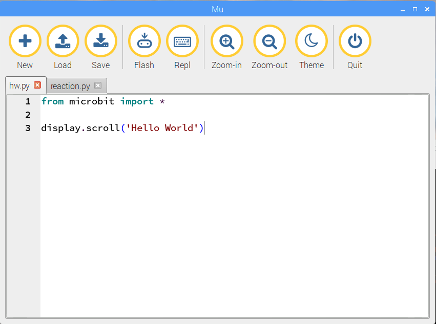
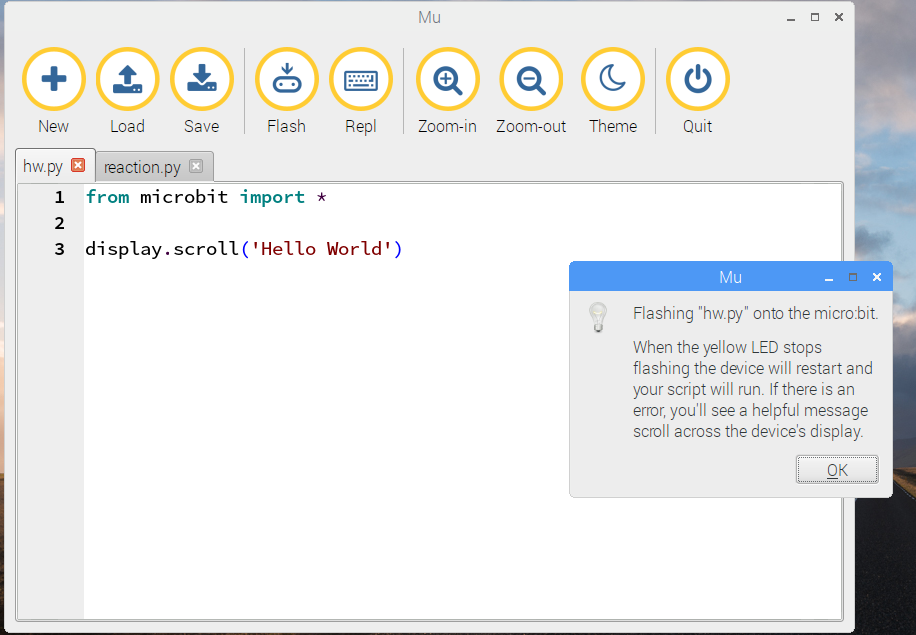

#Hello World!

##Typing in a program

In the **mu **editor, click the + (new) icon. You should see a new tab open in the editor. 

That's where you will type your code. 

The first program you'll run is the micro:bit version of _Hello World_. 

Here's the short program:

Here's what each line means:

1.  `from microbit import *` tells MicroPython that you want to use the microbit module.
   (In Python, a module is some code that is already written, ready for you to use if you want to.) 
1.  `display.scroll('Hello World')` will scroll the string 'Hello World!' across the LEDs on the micro:bit.

###Save it, Flash it, Watch it run!

1. Now you can save your file. Click on *mu*'s `Save` button.
Call the file `hw.py`

1. Next, you need to use the mysterious `Flash` button.
Press the button and a dialogue box should appear:

   
   
   After a few seconds, another dialogue will open, telling you about the
   mountable file system. You can close both dialogues.

Once your program has been *flashed* (installed in the micro:bit's memory),
you should see 'Hello World' scroll across the LEDs on the front of
the micro:bit. 

###Troubleshooting

The display will finish quite quickly. If you missed it, just press the button that is
underneath the microbit next to the USB cable. This will restart the micro:bit and your program will re-run.

If you don't see the display that you expected, here are some steps to help you
find out what went wrong.

1. Carefully check what you typed. It's easy to make a mistake, and the computer
cannot guess what you meant to type! If you spot a mistake, correct it and fkash the program again.

1. If you can't spot a mistake, ask someone else to check your program. It's often easier for them to spot a mistake
than it is for you, because you may be seeing what you meant to type rather than what is 
actually there!

1. If that doesn't help, as me. Don't be embarrassed. Just about everyone makes some mistakes when they
program.