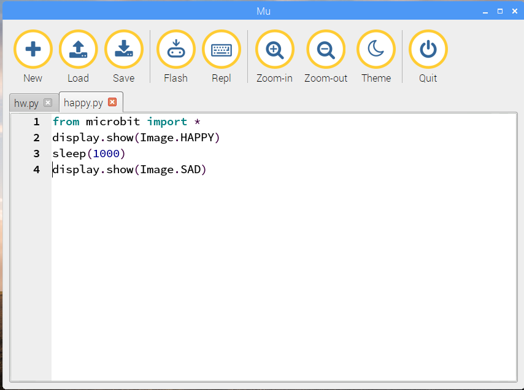

#Images

The micro:bit only has 25 LEDs but that's enough for it to display
recognisable images.

In this experiment you will write code to 

1. display images on the LEDs.
1. change the display while your program is running,
1. display an animation and
1. create your own images

You may not have time to do all these activities today
but you can try them out later.

##Displaying a happy face

Open a new tan in *mu* and type in this program:

    from microbit import *
    display.show(Image.HAPPY)
    

You've seen the first line before. It says you want to use the mircobit module
(library).

The second line tells the micro:bit display to show an image. In this case, the
image is pre-defined in the microbit module, and you can refer to it as `Image.HAPPY`
 
Save your program as `happy.py` and click *mu*'s `Flash` button.
Two dialogs will appear again. Close the dialogs as before.
When the flashing stops you should see a happy
face displayed on the micro:bit.

##Changing the display to a sad face

The next program is a little longer, but it starts the same as the previous one.

In the `happy.py` window, add tow lines to the end of the program:

    sleep(1000)
    display.show(Image.SAD)
    
Your editor window should look like this:

Use *mu*'s `Flash` button to install your program.

When the program runs you should see a happy face appear for a second.
Then it will be replaced by a sad face which will
stay on the display until you restart the micro:bit.
    

##Making your own images

##Animation - images that change

